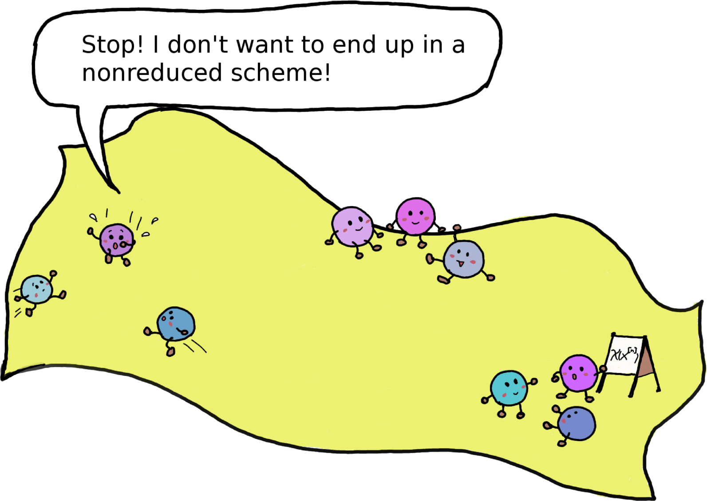

# A one-parsec overview of the Hilbert scheme of points

Given a geometric object X, the Hilbert scheme X^{[n]} is the fine
moduli space of unordered collections of n points in X. If X is a
smooth projective surface, the Hilbert scheme is a smooth connected
manifold of dimension 2n, so not at all a scary singular scheme. This
is in constrast to the naive set-theoretical quotient X^n / S_n, which is in
general non-singular along the diagonal.

Hilbert schemes exhibit an intriguing geometry and establish a remarkable
connection between geometry, algebra, and combinatorics. For
instance, they have been used to settle famous conjectures in
combinatorics relating Macdonald polynomials and diagonal harmonics.

The talk will give a small and informal glimpse on these topics,
requiring only basic familiarity with algebraic topology. On the way,
we'll meet explicit models with commuting matrices, the calculation of
Euler characteristics using fixed point methods, Young diagrams for
partitions, and creation and annihilation operators from quantum
mechanics.

**See [the handwritten notes](notes.pdf) (six pages).**

Also check out these resources:

* Dori Bejleri. [Hilbert schemes: geometry, combinatorics, and representation theory](www.math.brown.edu/~dbejleri/Hilbert%2520Schemes%2520-%2520Grad%2520Student%2520Seminar.pdf).
* José Bertin. [The punctual Hilbert scheme: an introduction](https://www-fourier.ujf-grenoble.fr/sites/ifmaquette.ujf-grenoble.fr/files/bertin_rev.pdf).
* Tristan Bozec. [Homological study of some Hilbert schemes](http://www.math.u-psud.fr/~merker/CMI-ENS-Exchange/2010/expose-bozec.pdf).
* Mark Haiman. [Notes on Macdonald polynomials and the geometry of Hilbert schemes](https://math.berkeley.edu/~mhaiman/ftp/newt-sf-2001/newt.pdf).
* Paul Johnson. [The topology of Hilbert schemes of points on orbifolds](http://paul-johnson.staff.shef.ac.uk/Talks/TopGHilbImperial.pdf).
* Manfred Lehn. [Lectures on Hilbert schemes](http://www.mathematik.uni-mainz.de/Members/lehn/ar/montreal.ps).
* Daniel Litt. [The Hilbert scheme of points on a surface](http://math.stanford.edu/~dlitt/exposnotes/hilbertpoints.pdf).
* Emanuele Macrì. [Introduction to Hilbert schemes – exercises](http://nuweb15.neu.edu/emacri/HilbertSchemesExercises.pdf).
* Hiraku Nakajima. Lectures on Hilbert schemes of points on surfaces.
* Andrei Okounkov. [Problems for lecture I and II at the Andrejewski Day 2013](http://www.math.uni-augsburg.de/andrejewski-2013/program.html).
* Brendan Pawlowski. [Torus actions and maximal tori, part 2](http://chromotopy.org/torus-actions-maximal-tori-2).

The drawing is by Carina Willbold (CC BY SA).
